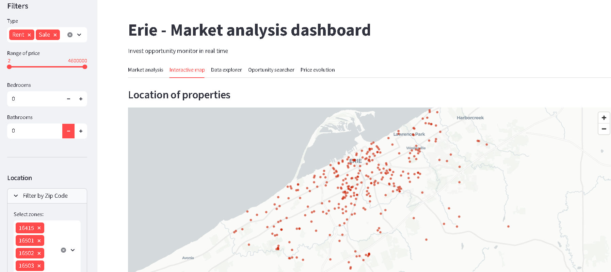
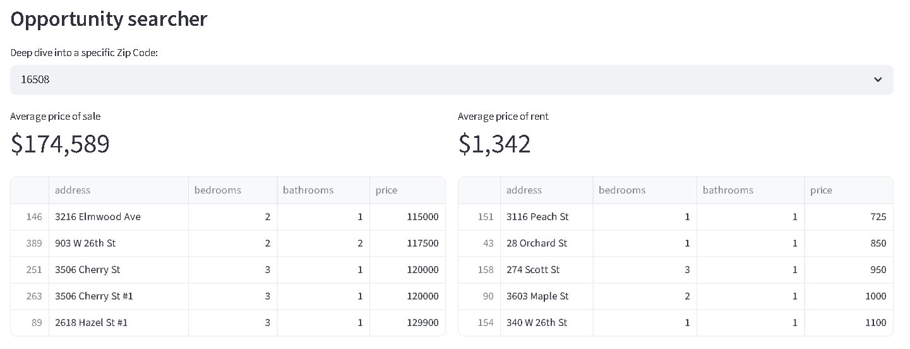
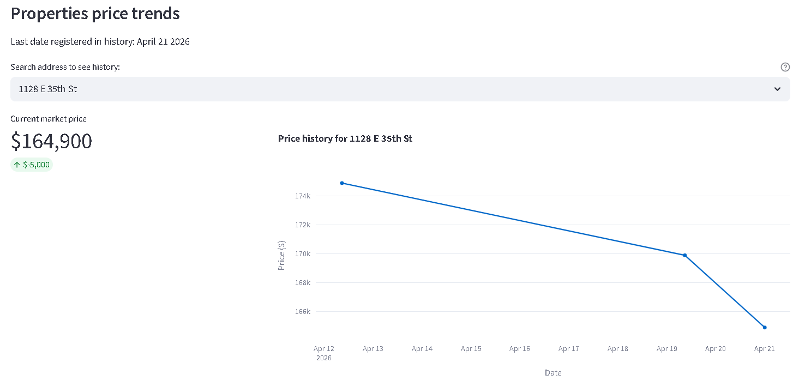

#  Erie Housing Insight: End-to-End Data Pipeline & Analytics

[](https://streamlit.app)

A professional-grade **Data Engineering Pipeline** designed to monitor and analyze the real estate market in Erie, PA. This system automates data extraction from multiple APIs, cleanses and normalizes records, maintains a historical price database, and visualizes investment opportunities through an interactive dashboard.

 <!-- Agrega aquí una captura de tu dashboard -->

##  Key Features

*   **Automated Weekly ETL:** Fully automated extraction cycles using **GitHub Actions**, ensuring a "set-and-forget" data update mechanism.
*   **Price History Tracking:** Custom persistence logic that tracks price fluctuations over time for each property, enabling time-series market analysis.
*   **Data Integrity & Validation:** Rigorous data cleaning using **Pydantic** models to ensure type safety and schema consistency before database ingestion.
*   **Investment Opportunity Engine:** A dynamic tool that identifies properties listed below the local ZIP code average, helping investors find high-value deals.

###  Data-Driven Insights


##  Tech Stack

*   **Language:** Python 3.11+
*   **Data Ingestion:** RapidAPI (Zillow Engine) & RentCast API.
*   **Database:** PostgreSQL (Hosted on **Supabase**).
*   **Data Processing:** Pandas, Pydantic, Geopy (Nominatim).
*   **Dashboarding:** **Streamlit** & Plotly Express.
*   **DevOps/CI-CD:** GitHub Actions & Streamlit Cloud.

##  System Architecture

1.  **Ingestion Layer:** Fetches raw sales and rental data via REST APIs.
2.  **Processing Layer:** Cleanses addresses, deduplicates records based on unique street addresses, and handles coordinate mapping.
3.  **Persistence Layer:** Executes `upsert` operations on the master property table and `insert` operations on the historical price table using a surrogate key mapping.
4.  **Presentation Layer:** A real-time web application that serves filtered insights and trend visualizations.

##  Engineering Challenges & Solutions

*   **Deduplication Logic:** Implemented a robust filtering system using Python `sets` and address normalization to prevent redundant entries from multiple API sources.
*   **Temporal Consistency:** Standardized date formats to ISO8601, resolving conflicts between cloud database timestamps and Pandas datetime objects.
*   **Geocoding Optimization:** Developed a custom address-cleaning regex to improve coordinate accuracy and handled API rate limits using a controlled sleep mechanism.

### 📈 Historical Tracking


##  Project Structure

```text
├── .github/workflows/       # CI/CD Pipeline (GitHub Actions)
├── app.py                   # Streamlit Dashboard (Entry Point)
├── main.py                  # ETL Orchestrator
├── db_connection.py         # Supabase/PostgreSQL Logic
├── processor.py             # Data Cleaning & Transformation
├── scraper_engine.py        # API Ingestion Logic
├── models.py                # Pydantic Data Models
├── requirements.txt         # Project Dependencies
└── README.md                # Project Documentation
```

##  Setup & Installation

1. **Clone the repository:**
   ```bash
   git clone https://github.com
   ```
2. **Install dependencies:**
   ```bash
   pip install -r requirements.txt
   ```
3. **Environment Variables:** Create a `.env` file with the following:
   ```env
   SUPABASE_URL=your_supabase_url
   SUPABASE_API_KEY=your_supabase_key
   ZILLOW_API_KEY=your_rapidapi_key
   RENTCAST_API_KEY=your_rentcast_key
   ```
4. **Run the Application:**
   *   To trigger the pipeline: `python main.py`
   *   To launch the dashboard: `streamlit run app.py`

---
Developed by Pau Ferrer Collado
